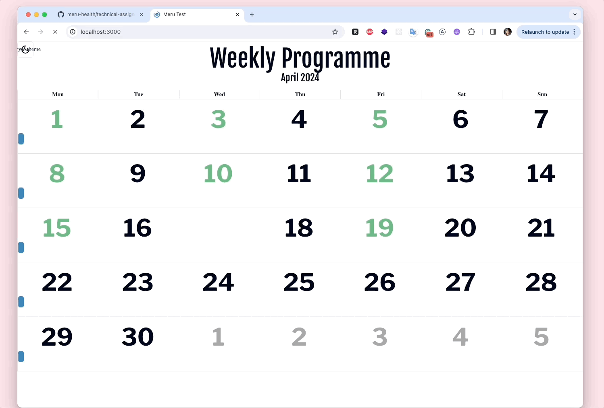

# Project Overview

This project aims to create an application that presents a 3-week treatment program visually on a calendar interface. The treatment program data is provided in a JSON format and the desired output adheres to a specific design.

## Input Format

The input for the 3-week treatment program is structured as follows:

jsonCopy code

`{
  "week<number>": [{
    "weekday": "MONDAY" || "TUESDAY" || "WEDNESDAY" || "THURSDAY" || "FRIDAY" || "SATURDAY" || "SUNDAY",
    "title": "Title for the daily activity",
    "completed": true || false
  }, ...]
}`

Each week contains multiple activities, each described by the day of the week, a title, and a completion status.

## Output Design

Currently, design loooks like this

The treatment program is visualized on a calendar with the following features:

- Current month is displayed, with the current day highlighted.
- The program starts on the first full week of the month and spans three weeks.
- Daily activities are displayed under the respective day number.
- Day numbers have different colors based on activity presence.
- Incomplete activities from past days are moved to the current day.
- Only one activity is displayed per day.

The output design matches the provided picture and adheres to specific color and text style specifications.

## Technology

The project utilizes React framework for implementation. Other tools and 3rd party libraries are allowed based on individual preference.

## Project Structure

- NextJS with React: Utilized NextJS for pre-fetching events and React for frontend development.
- UI Components: Tailwind and Shadcn UI were used for UI design, with day/night themes implemented using Tailwind and toggle UI.
- Calendar Implementation: I initially was intending to use https://www.npmjs.com/package/@fullcalendar/react to do calendar implementation, however, after comparing it to other calendar solutions react-big-calendar as the best way to implememt it.
- Incomplete Events Handling: In the description, it says that "if a user has not completed an activity in the past, the activity will be moved to the current day" - which is what I kept. Since there can be only one activity per day,if there are multiple incomplete activities in the past, the first incomplete activity will be displayed today, however from that point I did change the logic: the following activities are not happening in a row, but rather on consecutive correct days of the week
- Testing: Originally planned to use Jest for testing, however, pivoted to vitest due to time constraints and additional optimization efforts.

## TODO

One potential improvement to the project would be proper tailwind setup: currently, we have to use tailwind CDN to make sure all modules are imported correctly
